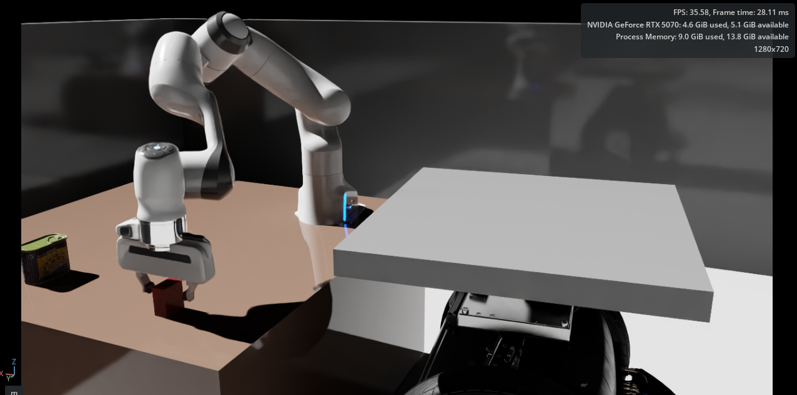
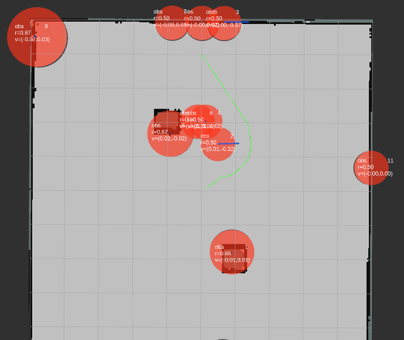
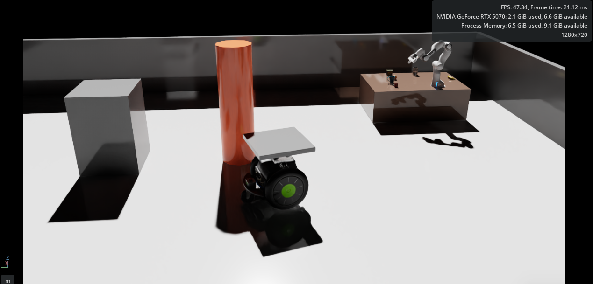
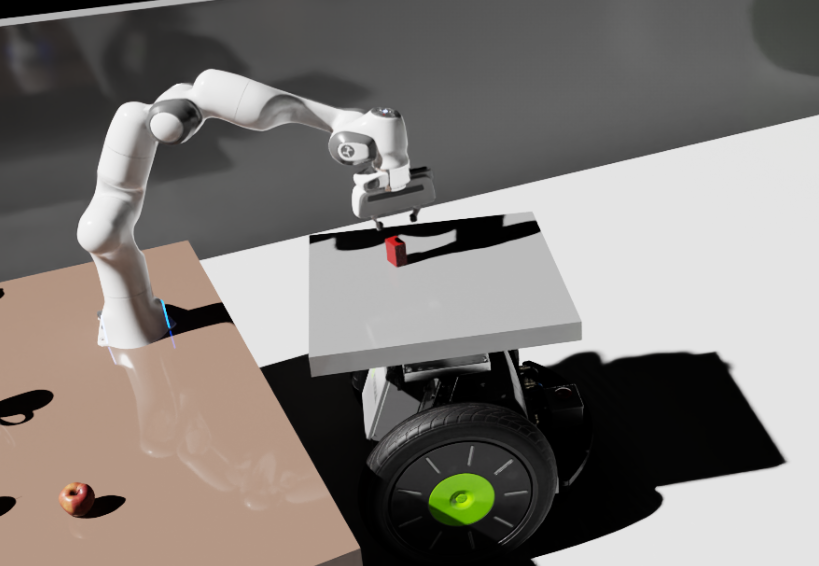
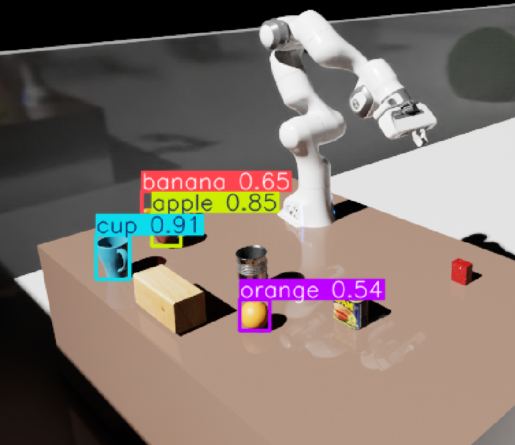
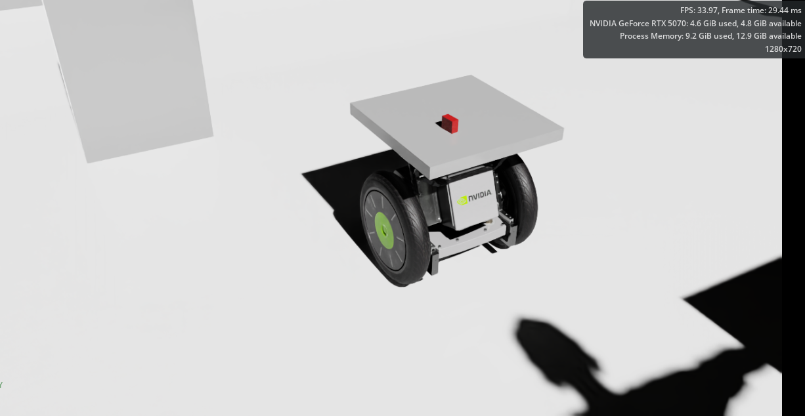

# Isaac Sim AMR Warehouse Automation

#### ROS2 Autonomous Mobile Robot · A* / MPC / CBF Navigation · RGB-D / YOLO Perception · Franka Pick-and-Place

This repository implements an end-to-end warehouse automation scenario in NVIDIA Isaac Sim. A Carter AMR navigates to a picking station, a fixed Franka arm detects and picks an object from the station, places it on the AMR tray, and the AMR returns to the origin.

The project extends a Gazebo-based AMR autonomy stack into Isaac Sim and adds perception, manipulation, docking, undocking, TF/odom cleanup, and latency evaluation.



---

## Overview

The final mission scenario is:

1. Carter starts in an Isaac Sim warehouse scene.
2. The AMR navigates to a picking station using LiDAR, SLAM, A* global planning, MPC path tracking, and CBF-based safety filtering.
3. Carter docks near the fixed Franka manipulator.
4. A station RGB-D camera detects the target object.
5. RGB-D depth projection and camera-to-world TF generate a robot-frame pick pose.
6. Franka executes pick, lift, place-on-tray, and home motions through MoveIt2.
7. After the arm returns home, Carter undocks, retreats away from the station, returns to the origin, and aligns to yaw = 0 deg.

This project focuses on full-system robotics integration rather than a single isolated algorithm: simulator setup, ROS2 interfaces, TF frames, navigation, obstacle tracking, perception, manipulation, mission sequencing, and quantitative latency measurement.

---

## Key Results

| Area | Result |
|---|---|
| AMR navigation | Carter reached the station through A* global planning and MPC tracking |
| Docking | Station docking completed without collision after docking-specific planner/controller fixes |
| Perception | RGB-D pick pose generated from image pixel + depth + camera intrinsics |
| Camera calibration | Single-point manual offset replaced by TF-based camera-to-world transform |
| Pick generalization | Cube pick pose followed object movement across center/left/right/front/back station test points |
| YOLO pick pose | `apple`, `banana`, `cup`, `orange` class targets drove Franka motion toward detected objects |
| Manipulation | Franka pick/place/home sequence connected to perception-generated pick pose |
| Return mission | Carter returned to origin after Franka placed the object and reached home |
| Final yaw alignment | Origin yaw alignment to 0 deg validated |
| MPC solve time | mean 2.24 ms, p99 2.97 ms, max 6.17 ms |
| End-to-end latency | mean 14.21 ms, p99 29.93 ms, max 31.75 ms |
| Latency KPI | p99 < 50 ms: PASS, 0 / 1699 samples above 50 ms |

Latency was measured for 180 seconds with 1699 samples.

---

## System Architecture

```text
NVIDIA Isaac Sim
  Carter AMR
  Fixed Franka station
  Station RGB-D camera
  LiDAR / IMU / odometry / clock
        |
        v
ROS2 Humble
  scan_fix_node
    /scan_raw -> /scan
  slam_toolbox
    /scan -> /map, map context
  odom_tf_broadcaster_node
    /odom -> odom->base_link TF
  obstacle_tracker_node
    /scan -> /obstacles/detected
  path_planner_node
    A* -> /planned_path
  mpc_node
    MPC + CBF + docking/undocking state machine -> /cmd_vel
        |
        v
Isaac Sim Carter motion

Station perception and manipulation
  /station_camera/image_raw
  /station_camera/depth
  /station_camera/camera_info
        |
        v
  red_cube_detector_node or yolo_detector_node
        |
        v
  RGB-D projection -> camera frame 3D point
        |
        v
  TF: station_camera_rgb -> world/planning frame
        |
        v
  /perception/pick_pose
        |
        v
  perception_pick_commander_node
        |
        v
  pick_place_node -> MoveIt2 -> Franka
        |
        v
  return_to_origin_trigger_node -> /goal_pose
```

---

## Core Features

### AMR Navigation



- Isaac Sim Carter integration through ROS2 `/cmd_vel`, `/odom`, `/imu`, `/scan_raw`, and `/clock`.
- `/scan_raw` correction node for SLAM and obstacle tracking compatibility.
- A* global planner over occupancy grid and LiDAR-updated obstacle information.
- MPC path tracking with a custom OSQP-based controller inherited from the original AMR stack.
- CBF safety filter and front-safety behavior for close-range obstacle response.
- Docking-specific mode near the station to avoid over-conservative inflation blocking the final goal.

### LiDAR Obstacle Tracking and Safety



- LiDAR clustering and obstacle tracking from `/scan`.
- Obstacle merge logic to handle cases where a person-like object appears as separated small clusters in 2D LiDAR.
- EMA smoothing, persistence timeout, matching distance, minimum radius, and merge distance tuning.
- Global/local role separation:
  - A* handles static obstacles and major route selection.
  - MPC tracks the global reference.
  - CBF/FrontSafety handles local dynamic obstacle response.

### RGB-D Pick Pose Generation



The perception pipeline computes 3D object position from RGB-D data:

```text
X = (u - cx) * Z / fx
Y = (v - cy) * Z / fy
Z = depth
```

where `(u, v)` is the object center pixel, `Z` is median depth around the target region, and `fx, fy, cx, cy` come from `CameraInfo`.

At first, simply used a single manually tuned offset:

```text
camera_to_panda_translation: [0.35, -0.256, -1.726]
```

Then it has been replaced with a TF-based camera-to-world transform. Five station positions were used to validate that camera-frame 3D points map consistently into the world/planning frame:

| Test point | Camera point `(x, y, z)` | Cube world position `(x, y, z)` |
|---|---|---|
| Center | `(0.2946, 0.2598, 1.7559)` | `(3.3, -2.969, 0.535)` |
| Left | `(0.4366, 0.2183, 1.8906)` | `(3.1, -2.969, 0.535)` |
| Right | `(0.0840, 0.3219, 1.5514)` | `(3.6, -2.969, 0.535)` |
| Front | `(0.5220, 0.3276, 1.5388)` | `(3.3, -2.65, 0.535)` |
| Back | `(0.0710, 0.1845, 1.9664)` | `(3.3, -3.287, 0.535)` |

This is conceptually an eye-to-hand / camera-to-robot extrinsic calibration problem using 3D-3D rigid registration.

Final station camera TF parameters used in the W8 launch:

```text
camera_tf_x:      1.53886
camera_tf_y:     -1.34240
camera_tf_z:      0.81309
camera_tf_roll:  -1.88128
camera_tf_pitch: -0.01250
camera_tf_yaw:    0.78420
camera frame: station_camera_rgb
```

### YOLO Object Detection to Pick Pose & Franka Manipulation



- YOLO detector subscribes to `/station_camera/image_raw`.
- Detection results are published to `/detection/objects`.
- `yolo_pick_pose_node` selects the target class, samples depth inside the bounding box, projects it into camera coordinates, transforms it into the planning frame, and publishes `/perception/pick_pose`.
- `target_class` can be changed, e.g. `apple`, `banana`, `cup`, `orange`.

The project validates that the arm moves toward YOLO-detected object locations. Actual grasp success depends on object geometry and gripper suitability; cube-like objects are easier for the simple parallel gripper than curved or thin objects.

- Fixed Franka station instead of Carter-mounted mobile manipulator.
- MoveIt2 pose-goal execution for arm motion.
- Separate gripper open/close command path.
- Pick sequence:

```text
open -> pre_pick -> pick -> close -> lift -> pre_place -> place -> open -> home
```

- Perception result updates the pick pose at runtime through `perception_pick_commander_node`.
- Place and home poses are kept as validated station/tray poses.

### Return-to-Origin Mission



After Franka places the object and reaches home:

1. `return_to_origin_trigger_node` publishes `/goal_pose`.
2. `path_planner_node` generates a return path.
3. `mpc_node` enters undocking behavior before normal navigation.
4. Carter first aligns away from the station with `v = 0`, `w only`.
5. Carter retreats away from the station.
6. Normal A*/MPC navigation resumes.
7. Carter returns to the origin and aligns yaw to 0 deg.

This state-based undocking logic prevents the AMR from immediately driving into the station after loading.

---

## Performance Results

### End-to-End Latency

Measurement file:

```text
tools/step7_e2e_result.txt
```

Sampling:

| Metric | Value |
|---|---:|
| Samples | 1699 |
| Duration | 180.0 s |
| Sampling frequency | 9.4 Hz |

MPC solve time:

| Statistic | Value |
|---|---:|
| Mean | 2.24 ms |
| Median | 2.14 ms |
| Min | 1.94 ms |
| Max | 6.17 ms |
| p90 | 2.60 ms |
| p95 | 2.77 ms |
| p99 | 2.97 ms |
| Std | 0.27 ms |

End-to-end odom-to-control latency:

| Statistic | Value |
|---|---:|
| Mean | 14.21 ms |
| Median | 13.52 ms |
| Min | 2.12 ms |
| Max | 31.75 ms |
| p90 | 25.75 ms |
| p95 | 27.76 ms |
| p99 | 29.93 ms |
| Std | 7.41 ms |

KPI:

| KPI | Target | Result |
|---|---:|---:|
| E2E latency p99 | < 50 ms | 29.93 ms |
| E2E > 50 ms count | 0 desired | 0 / 1699 |

The control loop was not bottlenecked by MPC computation. Most average latency came from odom-to-control waiting time, while MPC solve itself remained below 3 ms at p99.

### Dynamic Obstacle Avoidance

To validate the reactive safety behavior, I tested a dynamic obstacle moving laterally across the AMR's navigation path in Isaac Sim.
The analysis was performed only on the active avoidance window (`2-25 s`) to exclude docking, manipulation, and long stationary
phases.

The result shows that the AMR avoided the moving obstacle without collision while maintaining real-time control performance.

| Dynamic Obstacle Avoidance Metric | Result |
|---|---:|
| Analysis window | 2-25 s |
| Collision count | 0 |
| Minimum obstacle clearance | 0.197 m |
| Clearance < 0.20 m ratio | 0.09% |
| Reactive safety intervention ratio | 34.78% |
| FrontSafety stop count | 8 |
| Max angular velocity | 0.255 rad/s |
| MPC solve time avg / p99 | 2.18 ms / 2.88 ms |
| E2E latency avg / p99 | 10.43 ms / 19.03 ms |

The safety layer reacted to the moving obstacle through speed reduction, temporary stops, and heading correction.
Although the CBF command correction ratio was `0.00%` in this run, the combined reactive safety layer, including FrontSafety and CBF
monitoring, successfully maintained collision-free navigation with a minimum clearance of `0.197 m`.

The end-to-end latency p99 remained `19.03 ms`, well below the `50 ms` real-time control target.

---

## Weekly Development Summary

| Week | Main work | Result |
|---|---|---|
| W1-W2 | Isaac Sim setup, scene setup, Carter selection, ROS2 bridge validation | Stable simulator foundation and Carter `/cmd_vel` control |
| W3 | Ported AMR ROS2 navigation stack to Isaac Sim | `/scan`, `/odom`, `/imu`, SLAM, planner, MPC integration validated |
| W4 | Added camera / RGB-D / YOLO perception experiments | Confirmed perception pipeline but exposed control instability when camera graph was active during driving |
| W5 | Stabilized LiDAR-only navigation and dynamic obstacle handling | Separated camera perception from navigation safety; tuned obstacle tracker, A*, MPC, CBF |
| W6 | Manipulator architecture redesign | Switched from Carter-mounted Franka to fixed Franka station + tray-carrying AMR |
| W7 | RGB-D red cube perception to Franka pick/place | Connected `/perception/pick_pose` to runtime pick sequence |
| W8 | Generalized pick pose, YOLO pick, return-to-origin, TF/odom cleanup, latency measurement | Completed end-to-end warehouse scenario |

---

## Key Engineering Decisions and Troubleshooting

### 1. Camera perception destabilized navigation control

After adding camera, RGB-D, CameraInfo, and YOLO-related Action Graph components in Isaac Sim, the AMR began showing stop-and-go behavior and unstable forward motion even though the MPC code itself had not changed.

Debugging approach:

- Compared the W3 stable setup and the W4 camera-added USD.
- Applied W4 USD changes to the W3 code path and reproduced the instability.
- Reverted to the W3 USD and recovered stable motion.
- Lowered camera render resolution and adjusted simulation gate settings to reduce some solve failures.

Conclusion:

Isaac Sim scene composition, camera Action Graphs, render products, and sensor helpers can affect control-loop timing and simulation load. Therefore, camera perception should not be blindly placed inside the driving control loop.

Final design:

- Driving safety is handled by LiDAR obstacle tracking, MPC, CBF, and FrontSafety.
- RGB-D / YOLO perception is used during stationary picking.
- Semantic camera perception is treated as a manipulation/perception module, not the sole navigation safety source.

This was a system architecture decision, not just parameter tuning.

### 2. A* path churn caused MPC stop-and-go behavior

When LiDAR obstacles were injected into A* replanning too aggressively, `/planned_path` changed frequently. MPC repeatedly reset its reference, which caused stop-and-go movement.

Fix:

- A* global planner handles static obstacles and major route changes.
- Dynamic obstacle response is primarily handled by local CBF/FrontSafety.
- Similar path updates are filtered.
- Immediate LiDAR-triggered global replanning is reduced.
- Off-path replanning remains available when the robot meaningfully deviates from the reference.

Key insight:

More replanning is not always safer. For MPC tracking, a stable reference path is often more important than reacting to every small obstacle update at the global planner level.

### 3. Mobile manipulator design was changed to fixed Franka station

The initial W6 plan was to mount Franka directly on Carter. This exposed Isaac Sim articulation and PhysX issues:

- Franka did not follow Carter when only visually placed on the tray.
- Collision overlap caused strong physical impulses.
- Parenting Franka under Carter broke internal joint relationships.
- Fixed-joint connection between independent articulation roots was unstable.

Final design:

- Carter carries a load tray.
- Franka is fixed at the picking station.
- Carter docks inside the Franka workspace.
- Franka picks from the station and places objects on the Carter tray.

This reduced simulation-asset risk and kept the project focused on navigation, perception, manipulation, and mission integration.

### 4. Single-point camera offset was replaced by TF-based calibration

W7 used a manually tuned translation that worked for one cube location. That was not enough for the project goal of picking objects from arbitrary reachable station positions.

Fix:

- Validated RGB-D camera-frame 3D point computation.
- Collected multiple camera point / world point pairs.
- Treated the problem as camera-to-world extrinsic calibration.
- Published camera TF and generated pick poses in the planning frame.

Result:

Moving the cube around the station caused the generated pick pose to move accordingly, and Franka approached the updated object location within its reachable workspace.

### 5. TF and odom inconsistency caused heading errors

Carter appeared aligned in ROS logs but visibly misaligned in Isaac Sim. `/odom`, `/ekf/odom`, `/map_ekf/odom`, RViz TF, and Isaac Sim body heading did not agree.

Fix:

- Unified planner and MPC odometry input to raw `/odom`.
- Ran `ekf_node` with `publish_tf:=false`.
- Added `odom_tf_broadcaster_node` to publish `odom -> base_link` from `/odom`.
- Disabled `map_ekf_node` by default in the final Isaac scenario.
- Kept `slam_toolbox` for map context.

Result:

Docking heading became consistent with Isaac Sim visual heading, and origin yaw alignment became reliable.

### 6. Docking and undocking needed mission-phase control

Treating docking/undocking as normal path tracking caused two collision risks:

- Near the station, map-update replanning could publish a very short path and keep MPC in normal navigation speed.
- After loading, Carter could immediately drive toward the station while trying to follow the return path.

Fix:

- Added early transition from `NAVIGATING` to `DOCKING` near the goal.
- Suppressed map-update replanning near the docking goal.
- Added station-aware undocking:
  - rotate in place away from station
  - retreat
  - then resume normal navigation
- Changed CBF failure fallback from nominal command to safe stop.

Result:

Carter docked, loaded, undocked, and returned without station collision.

---

## Build and Run

### Prerequisites

- Ubuntu 22.04
- ROS2 Humble
- NVIDIA Isaac Sim
- MoveIt2 for ROS2 Humble
- Python dependencies for perception (ultralytics, OpenCV, NumPy)
- Isaac Sim scene running with Carter, Franka, station camera, LiDAR, IMU, odometry, and ROS2 bridge topics

### Build

```bash
cd ~/isaac_amr_ws
colcon build --symlink-install
source install/setup.bash
```

### Start Isaac Sim

Open the Isaac Sim warehouse scene and press Play. The following topics should exist:

```text
/clock
/odom
/imu
/scan_raw
/station_camera/image_raw
/station_camera/depth
/station_camera/camera_info
/cmd_vel
```

### Navigation Bringup

```bash
ros2 launch scenarios isaac_navigation_bringup_lidar_only.launch.py
```

This launch starts the ROS2-side navigation stack:

- `scan_fix_node.py`
- static TF `base_link -> sim_lidar`
- static TF `base_link -> imu_link`
- `ekf_node` with TF disabled
- `odom_tf_broadcaster_node`
- `slam_toolbox`
- `obstacle_tracker_node`
- `path_planner_node`
- `mpc_node`

Default docking goal:

```text
goal_x = 2.62
goal_y = -3.3
```

### Red Cube Pick, Place, and Return

In a separate terminal:

```bash
source ~/isaac_amr_ws/install/setup.bash

ros2 launch manipulation w8_perception_pick_return.launch.py \
  use_sim_time:=true \
  start_rviz:=false \
  detector_transform_mode:=tf \
  start_camera_tf:=true \
  return_x:=0.0 \
  return_y:=0.0 \
  return_yaw:=0.0
```

After Carter completes docking, trigger the manipulation sequence:

```bash
ros2 service call /perception_pick_commander_node/start std_srvs/srv/Trigger {}
```

### YOLO Pick Pose Test

```bash
source ~/isaac_amr_ws/install/setup.bash

ros2 launch manipulation w8_yolo_perception_pick.launch.py \
  use_sim_time:=true \
  start_rviz:=false
```

Use `target_class:=<class_name>` to force the pick pose node to select a specific class. If `target_class` is empty, the node selects from available detections according to its configured policy.

### Latency Measurement

The latency measurement script used in the final evaluation is:

```text
tools/step7_e2e_latency.py
```

The final result is saved in:

```text
tools/step7_e2e_result.txt
```

---

## Repository Structure

```text
isaac_amr_ws/
├── src/
│   ├── amr_msgs/          # Custom messages for safety, obstacles, latency
│   ├── control_mpc/       # MPC, CBF, obstacle tracker, camera-LiDAR fusion experiments
│   ├── control_lqr/       # LQR controller experiments
│   ├── estimation/        # EKF, map EKF, odom TF broadcaster
│   ├── localization/      # slam_toolbox launch/config
│   ├── manipulation/      # Franka MoveIt bridge, perception pick commander, pick/place nodes
│   ├── perception/        # YOLO detector and RGB-D object projection nodes
│   ├── planning/          # A* planner and path planner node
│   ├── safety/            # Watchdog/state-machine/deadline monitor experiments
│   └── scenarios/         # Isaac Sim navigation bringup launches
├── images/
│   └── README figures
├── maps/
│   └── Isaac warehouse maps
├── tools/
│   ├── scan_fix_node.py
│   ├── step7_e2e_latency.py
│   └── step7_e2e_result.txt
└── README.md
```

---

## Limitations and Future Work

### Grasp quality

The project uses object detection and depth-centered pick pose generation. This is enough to move the gripper toward the target but does not guarantee robust grasping for curved or thin objects. Future work should add grasp pose estimation, suction grasping, or an adaptive gripper.

### Perception robustness

YOLO COCO classes do not perfectly match Isaac Sim assets. Lighting, object pose, and occlusion can cause confidence changes or unexpected labels. A custom dataset or fine-tuning would improve reliability.

### Calibration automation

The final camera transform was validated using manually collected station points. AprilTag, calibration board, or automated hand-eye calibration would make the procedure more repeatable.

### Jetson companion computer extension

A follow-up plan is included in:

```text
Jetson_Companion_Computer_Weekly_Plan.txt
```

The goal is to run selected ROS2 autonomy nodes on Jetson Orin Nano as a companion computer while Isaac Sim or Gazebo runs on the PC.

---

## References Used for Design Context

These references were used as technical background for the project design and troubleshooting direction:

- Hart, Nilsson, Raphael, [A Formal Basis for the Heuristic Determination of Minimum Cost Paths](https://doi.org/10.1109/TSSC.1968.300136), 1968.
- Khatib, [Real-Time Obstacle Avoidance for Manipulators and Mobile Robots](https://doi.org/10.1177/027836498600500106), 1986.
- Fox, Burgard, Thrun, [The Dynamic Window Approach to Collision Avoidance](https://www.ri.cmu.edu/publications/the-dynamic-window-approach-to-collision-avoidance/), 1997.
- Ames et al., [Control Barrier Function Based Quadratic Programs for Safety Critical Systems](https://arxiv.org/abs/1609.06408), 2017.
- Arun, Huang, Blostein, [Least-Squares Fitting of Two 3-D Point Sets](https://doi.org/10.1109/TPAMI.1987.4767965), 1987.
- Horn, [Closed-form Solution of Absolute Orientation Using Unit Quaternions](https://doi.org/10.1364/JOSAA.4.000629), 1987.
- Tsai and Lenz, [A New Technique for Fully Autonomous and Efficient 3D Robotics Hand/Eye Calibration](https://kmlee.gatech.edu/me6406/handeye.pdf), 1989.
- Redmon et al., [You Only Look Once: Unified, Real-Time Object Detection](https://arxiv.org/abs/1506.02640), 2016.
- Redmon and Farhadi, [YOLOv3: An Incremental Improvement](https://arxiv.org/abs/1804.02767), 2018.
- Mahler et al., [Dex-Net 2.0: Deep Learning to Plan Robust Grasps](https://arxiv.org/abs/1703.09312), 2017.

---

## Portfolio Summary

This project demonstrates:

- Migration of a Gazebo AMR autonomy stack into Isaac Sim.
- ROS2 integration across simulation, navigation, perception, manipulation, and mission sequencing.
- A* global planning, MPC tracking, and CBF safety filtering in a closed-loop robot scenario.
- Practical LiDAR obstacle tracking and dynamic-obstacle safety design.
- RGB-D perception, YOLO detection, and camera-to-robot pose transformation.
- MoveIt2-based Franka pick/place execution.
- TF/odom debugging across simulator, RViz, planner, and controller frames.
- Safety-oriented docking/undocking state machine design.
- Quantitative latency measurement with p99 control-loop analysis.

The final result is an end-to-end Isaac Sim warehouse mission: navigate, dock, detect, pick, place, return, and align.
